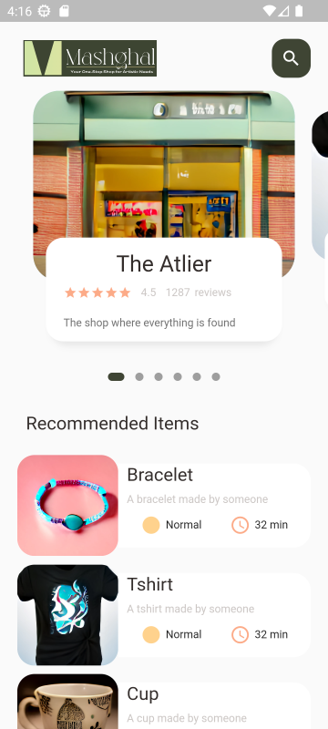
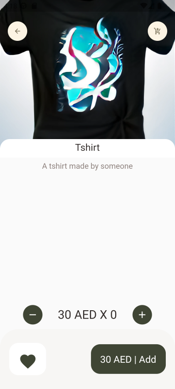

  
  
#### The Idea
Mashghal is an online ecommerce platform similar to etsy that enables individuals and small businesses to set up an online shop and sell their one-of-a-kind, handmade, or vintage goods, with a focus on providing clients with high-quality, locally sourced products. To make it simple for shoppers to find the products they are looking for, we will also offer a user-friendly interface, simple search, and gifting capabilities. 
## App Preview
  
